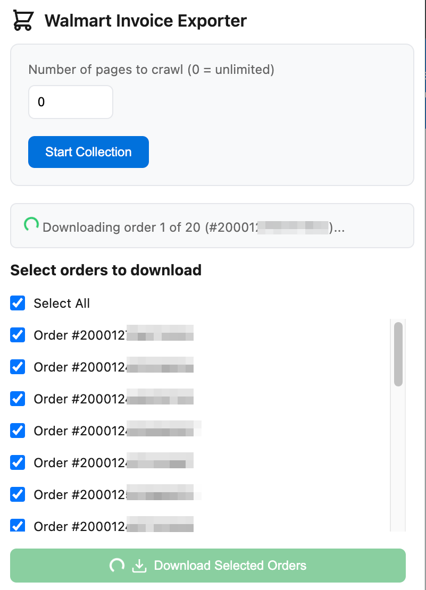

# Walmart Invoice Exporter

A Chrome extension that allows users to download their Walmart order history in XLSX format. Now with support for batch downloading multiple orders!

## Features

- **Batch Download**: Select and download multiple order invoices at once
- **Page Crawling**: Automatically collect order numbers from your order history
- **Customizable Limits**: Set how many pages of order history to crawl
- **Detailed Excel Format**: Each invoice includes:
  - Product details (name, quantity, price)
  - Delivery status
  - Product links
  - Order information (number, date)
  - Additional charges (delivery, tax, tip)
- **Secure**: Runs only on Walmart's orders pages with minimal required permissions

## Installation

### From Chrome Web Store

Install the Walmart Invoice Exporter directly from the [Chrome Web Store](https://chromewebstore.google.com/detail/walmart-invoice-exporter/bndkihecbbkoligeekekdgommmdllfpe).

### Manual Installation

1. Download or clone this repository
2. Open Chrome and go to `chrome://extensions/`
3. Enable "Developer mode" in the top-right corner
4. Click "Load unpacked" and select the extension directory
5. Pin the extension to your toolbar for easy access

## Usage

### Single Order Download

1. Navigate to a specific Walmart order page
2. Click the extension icon
3. Click "Download Invoice"

### Batch Download

1. Go to your Walmart order history page (https://www.walmart.com/orders)
2. Click the extension icon
3. Set the number of pages to crawl (0 = unlimited)
4. Click "Start Collection"
5. Wait for the order numbers to load (may take a few seconds)
6. Select the orders you want to download
7. Click "Download Selected Orders"
8. Wait for the download to complete (may take a few minutes)

## What's New in Version 2.0

- **Multiple Order Downloads**: Download several orders at once
- **Order History Crawler**: Automatically collect order numbers from your history
- **Improved UI**: New interface with progress tracking and order selection
- **Enhanced Extraction**: Better handling of different order number formats
- **Background Processing**: Smoother download handling with background operations

## Technical Details

- Uses Chrome's Manifest V3
- Requires `tabs` permission for batch processing
- Compatible with various Walmart order formats:
  - Regular orders (13 or 15 digits)
  - In-store purchases (20 digits)
- Implements ExcelJS for XLSX generation
- Handles concurrent downloads with proper throttling

## Limitations

- Works only on Walmart's order pages
- Download speed may vary based on network conditions
- Large batch downloads may take several minutes to complete

## Troubleshooting

If you encounter issues:

1. Ensure you're on a valid Walmart orders page
2. Check that the extension has necessary permissions
3. Try refreshing the page before downloading
4. For batch downloads, allow sufficient time between orders

## Contributing

Contributions welcome! Please:

1. Fork the repository
2. Create a feature branch
3. Commit your changes
4. Push to the branch
5. Submit a Pull Request

## License

MIT License - feel free to use and modify as needed.

## Support

For issues or feature requests, please:

1. Check existing issues in the repository
2. Submit a new issue if needed
3. Include specific details about the problem

## Privacy

This extension:

- Only runs on Walmart order pages
- Doesn't collect any personal data
- Processes all information locally
- Doesn't send data to external servers
