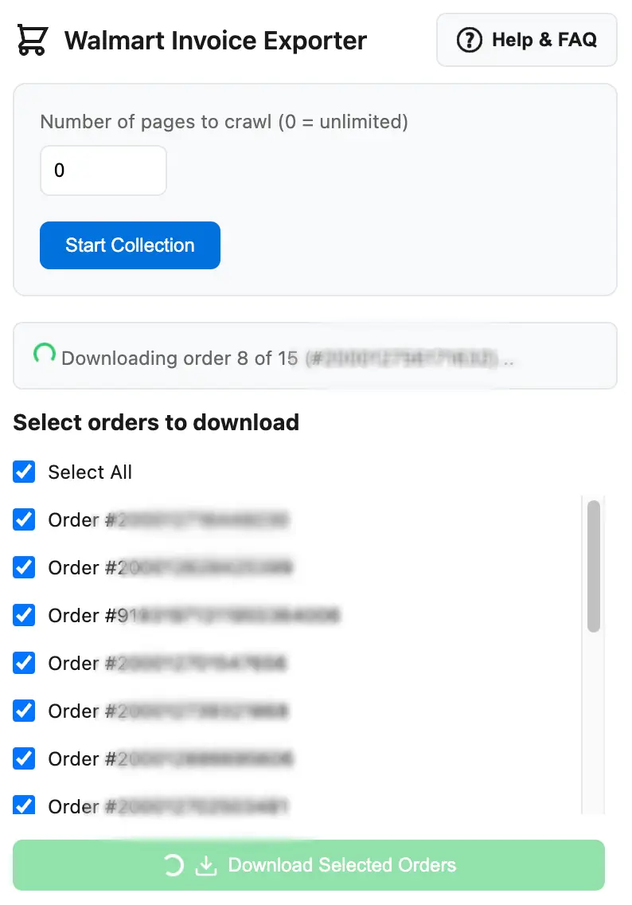

# Walmart Invoice Exporter

A Chrome extension that allows users to download their Walmart order history in XLSX format. Now with invoice caching, flexible export modes, and advanced performance optimizations!



## Features

- **Invoice Caching**: Downloaded invoices are automatically cached locally for instant re-access without re-downloading
- **Flexible Export Modes**: Choose between downloading individual files (one per order) or a combined single file with all items
- **Batch Download**: Select and download multiple order invoices at once
- **Page Crawling**: Automatically collect order numbers from your order history with customizable page limits
- **Smart Caching System**: Stores previously collected orders for faster repeat access or accidental closure (24-hour cache expiration)
- **Order Description Tooltips**: Hover over order numbers to see their delivery date or status
- **Smart Image Blocking**: Automatically blocks images during processing to improve speed and reduce network usage
- **Customizable Limits**: Set how many pages of order history to crawl (0 = unlimited)
- **Cache Management**: Per-order invoice cache indicators and ability to clear individual order caches
- **Detailed Excel Format**: Each invoice includes:
  - Product details (name, quantity, price)
  - Delivery status
  - Product links
  - Order information (number, date)
  - Additional charges (delivery, tax, tip)
- **Secure & Efficient**: Runs only on Walmart's orders pages with minimal required permissions
- **Centralized Configuration**: Maintains consistent selectors and styling throughout the extension using centralized constants

## Technical Details

- **Manifest V3**: Uses Chrome's latest manifest version for security and reliability
- **Permissions**:
  - `ActiveTabs` - Required for order page access and invoice downloads
  - `Storage` - Used for local storage of invoice cache and preferences
  - Host permissions for `https://www.walmart.com/*`
- **Caching System**:
  - Session storage for order numbers (24-hour auto-expiration)
  - Local storage for downloaded invoice data with per-order cache management
  - Page-level caching to avoid redundant API calls during collection
- **Order Format Support**:
  - Regular orders (13 or 15 digits)
  - In-store purchases (20+ digits)
  - Various order statuses (delivered, canceled, returned)
- **Excel Generation**: Implements ExcelJS for robust XLSX file creation
  - Support for single order exports with complete order summary
  - Multi-order consolidated exports combining all items into one sheet
  - Proper formatting with headers, fonts, and hyperlinks
- **Performance Optimizations**:
  - Aggressive image blocking (CSS, HTML elements, background images)
  - Content Security Policy implementation
  - Throttling between downloads to prevent rate limiting
  - Automatic retry with configurable timeout
  - Memory cleanup after each operation
- **Background Service Worker**: Efficient handling of collection and caching operations
- **Content Script Integration**: Direct DOM manipulation for order extraction with image blocking

## Performance Features

- **Invoice Caching**: Once downloaded, invoices are stored in local storage for instant re-access without re-downloading
- **Order Collection Caching**: Orders are cached for 24 hours with automatic expiration
- **Page Caching**: Already processed pages are skipped during collection to prevent redundant API calls
- **Smart Image Blocking**: Aggressive blocking strategy targeting:
  - HTML `` and `<picture>` elements
  - CSS background images and inline styles
  - Content Security Policy enforcement
  - Image constructor override
- **Throttling**: Configurable delays between downloads to prevent walmart.com rate limiting
- **Memory Optimization**: Automatic cleanup of resources after each order download
- **Background Processing**: Efficient handling of multiple downloads using browser background tabs
- **Smart Retries**: Automatic retry attempts with exponential backoff for failed downloads
- **Per-Order Cache Management**: Visual indicators show cached orders with ability to clear individual caches

## Limitations

- Works only on Walmart's order pages
- Download speed may vary based on network conditions
- Large batch downloads may take several minutes to complete
- Requires stable and fast internet connection for bulk downloads

## Installation

### From Chrome Web Store

Install the Walmart Invoice Exporter directly from the [Chrome Web Store](https://chromewebstore.google.com/detail/walmart-invoice-exporter/bndkihecbbkoligeekekdgommmdllfpe).

### Manual Installation

1. Download or clone this repository
2. Open Chrome and go to `chrome://extensions/`
3. Enable "Developer mode" in the top-right corner
4. Click "Load unpacked" and select the extension directory
5. Pin the extension to your toolbar for easy access

## What's New

### [Changelog](./CHANGELOG.md)

## Usage

### Single Order Download

1. Navigate to a specific Walmart order page
2. Click the extension icon
3. Click "Download Invoice"

### Batch Download with Export Modes

The extension offers two export modes for batch downloads:

#### Export Mode 1: Multiple Files (Default)
Downloads one XLSX file per order, each containing the full order details and summary.

#### Export Mode 2: Single Combined File
Downloads all selected orders into a single XLSX file with all items combined in one spreadsheet.

**To Use Batch Download:**

1. Go to your Walmart order history page (https://www.walmart.com/orders)
2. Click the extension icon
3. **(Optional)** Select your preferred export mode from the "Export mode" dropdown:
   - "Multiple files (one per order)" - Each order as a separate file
   - "Single file (all items)" - All items combined into one file
4. Set the number of pages to crawl (0 = unlimited)
5. Click "Start Collection"
6. Wait for the order numbers to load (may take a few seconds depending on page count)
7. Hover over order numbers to see their descriptions (delivery date, status) if needed
8. Look for the **cache icon** (📦) next to orders that have been previously downloaded - click to clear individual order caches if needed
9. Select the orders you want to download
10. Click the appropriate download button:
    - "Download Selected Orders" (for multiple files mode)
    - "Download as Single File" (for single file mode)
11. Wait for the downloads to complete

**Cache Management:**

- Downloaded invoices show a cache icon (📦) next to the order number
- Click the cache icon to clear that specific order's cached invoice
- Use the "Clear All Cache" button to clear all cached data at once
- Cached data automatically expires after 24 hours

## Troubleshooting

### Required Chrome Settings for Downloads

Before using the download feature, make sure to configure Chrome settings:

#### 1. Configure Download Settings:

- Open Chrome Settings or paste the following link in the address bar:

```
chrome://settings/downloads
```

- Click on "Downloads" in the left sidebar if not already selected
- Turn OFF "Ask where to save each file before downloading"
- Turn OFF "Show downloads when they're done"

#### 2. Enable Automatic Downloads:

```
chrome://settings/content/siteDetails?site=https%3A%2F%2Fwww.walmart.com#:~:text=Automatic%20downloads
```

- Open a new Chrome tab and paste the above link
- Find "Automatic downloads" option
- Set it to "Allow" (instead of Ask or Block)

#### Alternative Method: (If the above link doesn't work):

```
chrome://settings/content/automaticDownloads
```

- Open a new Chrome tab and paste the above link
- Under "**Allowed to automatically download multiple files**", click Add
- Enter `[*.]walmart.com` and click Add

> **Important**: All these settings are required for bulk downloads to work properly. Make sure to add walmart.com under "**Allowed to automatically download multiple files**" and NOT under "Not allowed to automatically download multiple files"

### Common Issues

**Issue: Popup appears but no orders are shown**
- Solution: Refresh the Walmart orders page and try again
- The cache is automatically loaded if available; otherwise, click "Start Collection"

**Issue: Download takes too long**
- Solution: Try downloading fewer orders at a time (5-10 orders initially)
- Check your internet connection speed
- Close unnecessary browser tabs and programs

**Issue: Some orders fail to download in batch mode**
- Solution: The extension will automatically retry failed orders
- Try downloading those specific orders individually
- Check the console (F12 > Console tab) for error details

**Issue: Cache icon appears but files won't re-download**
- Solution: Try clearing that specific order's cache by clicking the cache icon
- If needed, clear all caches and re-download

**Issue: Single file mode combines orders but items are not organized**
- Solution: The single file mode intentionally combines all items in one sheet
- If you need separate sheets per order, switch to "Multiple files" mode

**Getting Help:**

1. Read the FAQ in the extension popup ("Help & FAQ" button) for detailed guides
2. Check that the extension has necessary permissions
3. Verify Chrome download settings as described above
4. For batch downloads, start with smaller batches to identify issues
5. If you're still facing issues, please submit a detailed bug report with:
   - Screenshot of the error
   - Number of orders attempted
   - Your Chrome version
   - The browser console output (F12 > Console)

## Performance Tips

For best results when using the extension:

### During Order Collection:
1. Start with the default "0" (unlimited) page setting or a smaller number (2-5) to test
2. Don't close the popup or switch windows during collection
3. Keep the browser window active and focused
4. On slower connections, the collection may take time - be patient

### During Batch Downloads:
1. Close unnecessary browser tabs and applications
2. Start with smaller batches (5-10 orders)
3. Ensure stable and fast internet connection
4. For "Single file" mode with large selections, processing time increases with order count
5. Allow the extension to complete its process without interruptions
6. Keep the popup window open during downloads

### Cache Management:
1. Regularly check for cached orders (indicated by cache icons 📦)
2. Clear individual order caches when you want fresh data
3. Use "Clear All Cache" at the beginning of each month for a fresh start
4. Cache is automatically cleared after 24 hours

### Export Mode Selection:
1. Use **"Multiple files"** mode for easier organization and quick downloads
2. Use **"Single file"** mode when you need all items consolidated for analysis
3. You can switch between modes anytime - the preference is saved

## Contributing

Contributions welcome! Please:

1. Fork the repository
2. Create a feature branch
3. Commit your changes
4. Push to the branch
5. Submit a Pull Request

## Architecture

The extension is built with a modular design for maintainability:

**Core Files:**
- `manifest.json` - Extension configuration and permissions
- `popup.html/popup.js/popup.css` - User interface and main logic
- `background.js` - Background service worker for collection and caching
- `content.js` - Content script for DOM manipulation on Walmart pages
- `utils.js` - Shared utility functions for Excel generation and styling

**Key Components:**
1. **Cache System** - Manages order number caching and invoice storage
2. **Collection Engine** - Crawls Walmart pages to extract order numbers
3. **Export Engines** - Handles both single and multiple file export modes
4. **UI Controller** - Manages popup interface and user interactions
5. **Performance Optimizer** - Implements image blocking and throttling

**Data Flow:**
1. User initiates collection from popup
2. Background worker opens collection tab and sends messages to content script
3. Content script extracts order numbers and sends them back
4. Orders are cached locally and displayed in popup
5. User selects orders and initiates download
6. Background worker or popup processes each order and creates Excel files
7. Files are cached for future quick re-access

## Version History

For a complete list of changes, see [CHANGELOG.md](./CHANGELOG.md)

**Latest Features (v4.0):**
- Invoice caching for instant re-access
- Centralized configuration constants
- Enhanced cache management with per-order indicators

## Support

For issues or feature requests, please:

1. Check existing issues in the repository
2. Submit a new issue if needed
3. Include specific details about the problem

## Privacy & Data Security

This extension prioritizes your privacy and security:

**Data Storage:**
- Order numbers are stored in Chrome's session storage (temporary)
- Invoice data is stored in Chrome's local storage (on your device only)
- Order cache automatically expires after 24 hours
- No data is sent to external servers

**Only Runs On:**
- Walmart's order pages (`https://www.walmart.com/orders*`)
- Cannot access other websites or your browsing history

**Permissions Explanation:**
- `activeTab` - Allows the extension to access the current Walmart order page
- `storage` - Allows local caching of invoices and preferences on your device
- `host_permissions` for `walmart.com` - Required to access Walmart order data

**Data Processing:**
- All PDF parsing and Excel generation happens locally in your browser
- Images are blocked for performance (not accessed or stored)
- No tracking or analytics implemented
- No cookies or external API calls

**Your Control:**
- You can clear all cached data anytime using the "Clear All Cache" button
- You can delete individual order caches by clicking the cache icon
- Cache is always under your control in your browser's storage

## Acknowledgments

Special thanks to all the users who provided feedback for making this extension more efficient and user-friendly. This project is continually improved based on community feedback and real-world usage patterns.

**Dependencies:**
- [ExcelJS](https://github.com/exceljs/exceljs) - For robust XLSX file generation

## License

MIT License - feel free to use and modify as needed.
