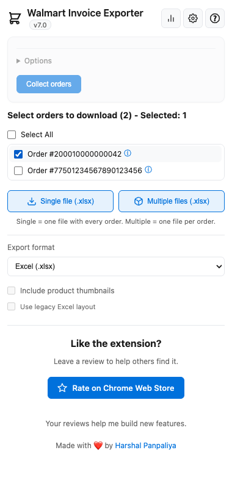

# Walmart Invoice Exporter

A Chrome extension that allows users to download their Walmart order history as Excel, CSV, JSON, or printable receipts. Now with a redesigned panel, dark mode, unified on-device storage, and instant re-export of orders you've already downloaded!



## Features

- **Two clear download buttons**: "Single file" (one workbook/file with every selected order) and "Multiple files" (one file per selected order) — the format you've chosen (Excel/CSV/JSON/receipt/PDF) is shown right in the button label, e.g. "Single file (.xlsx)"
- **Multiple Export Formats**: Excel (default), accounting-friendly CSV, structured JSON, or a printable HTML receipt you can print to PDF
- **Legacy Excel layout (opt-in)**: restores the older single-sheet workbook for anyone who prefers it; the modern Orders/Items two-sheet layout stays the default
- **Instant re-export**: Orders you've already downloaded live on this device and re-export immediately in any format — nothing is ever fabricated or guessed
- **Batch Download**: Select and download multiple order invoices at once
- **Page Crawling**: "Collect orders" automatically gathers order numbers from your order history, with page-limit and "only new orders" options tucked under a small Options disclosure
- **Order Description Tooltips**: Hover over order numbers to see their delivery date or status
- **Smart Image Blocking**: Automatically blocks images during processing to improve speed and reduce network usage
- **Customizable Limits**: Set how many pages of order history to crawl (0 = unlimited)
- **Dedicated Settings view**: a gear icon in the header opens Appearance (System/Light/Dark theme), Collection defaults, Export defaults, "Data on this device", and About
- **Dark mode & accessibility**: light/dark/system theming, visible keyboard focus rings, reduced-motion support, and ARIA labeling throughout
- **Unified on-device storage**: everything the extension stores lives in one place (IndexedDB) with a single "Delete all saved data" control in Settings — no more scattered cache buttons, and no more "cache won't clear"
- **Detailed Excel Format**: Each invoice includes:
  - Product details (name, quantity, price)
  - Delivery status
  - Product links
  - Order information (number, date)
  - Shipping address 
  - Payment method and per-card payment split
  - Order subtotal (before fees and taxes)
  - Order total (final amount)
  - Additional charges (delivery, tax, tip) plus refunds and donations
  - Marketplace seller(s), fulfillment type, delivered date, and tracking numbers
  - Receipt barcode link, and optional embedded product thumbnails
- **Secure & Efficient**: Runs only on Walmart's orders pages with minimal required permissions
- **Centralized Configuration**: Maintains consistent selectors and styling throughout the extension using centralized constants

## Technical Details

- **Manifest V3**: Uses Chrome's latest manifest version for security and reliability
- **Permissions**:
  - `ActiveTabs` - Required for order page access and invoice downloads
  - `Storage` - Used for local storage of preferences and settings
  - Host permissions for `https://www.walmart.com/*`
- **Unified On-Device Storage**:
  - Downloaded orders are saved in IndexedDB, with no expiration
  - A single "Delete all saved data" control (Settings → Data on this device) clears everything at once
  - Page-level caching within a collection run to avoid redundant requests
  - No servers, no telemetry — all data stays on your device
- **Order Format Support**:
  - Regular orders (13 or 15 digits)
  - In-store purchases (20+ digits)
  - Various order statuses (delivered, canceled, returned)
- **Excel Generation**: Implements ExcelJS for robust XLSX file creation
  - Default two-sheet workbook (Orders + Items) for clean, safely-summable rows; a "Use legacy Excel layout" opt-in restores the older single-sheet format
  - Multi-order consolidated exports combining all items into one sheet with subtotal and total columns
  - Proper formatting with headers, fonts, and hyperlinks
- **Performance Optimizations**:
  - ExcelJS (884 KB) is loaded only when actually needed for an Excel export — it's no longer injected into every walmart.com/orders page
  - Aggressive image blocking (CSS, HTML elements, background images)
  - Content Security Policy implementation
  - Throttling between downloads to prevent rate limiting
  - Automatic retry with configurable timeout
  - Memory cleanup after each operation
- **Background Service Worker**: Efficient handling of collection and storage operations
- **Content Script Integration**: Direct DOM manipulation for order extraction with image blocking

## Performance Features

- **Instant Re-export**: Once downloaded, an order's full data is stored on-device and reused for any future export in any format — no re-visiting the order page
- **Page Caching**: Already processed pages are skipped during collection to prevent redundant API calls
- **Smart Image Blocking**: Aggressive blocking strategy targeting:
  - HTML `` and `<picture>` elements
  - CSS background images and inline styles
  - Content Security Policy enforcement
  - Image constructor override
- **Throttling**: Configurable delays between downloads to prevent walmart.com rate limiting
- **Memory Optimization**: Automatic cleanup of resources after each order download
- **Background Processing**: Efficient handling of multiple downloads using browser background tabs
- **Smart Retries**: Automatic retry attempts with exponential backoff for failed downloads
- **Saved-Order Indicators**: A "saved" badge marks orders that are already stored on-device

## Limitations

- Works only on Walmart's order pages
- Download speed may vary based on network conditions
- Large batch downloads may take several minutes to complete
- Requires stable and fast internet connection for bulk downloads

## Installation

### From Chrome Web Store

Install the Walmart Invoice Exporter directly from the [Chrome Web Store](https://chromewebstore.google.com/detail/walmart-invoice-exporter/bndkihecbbkoligeekekdgommmdllfpe).

### Manual Installation

1. Download or clone this repository
2. Open Chrome and go to `chrome://extensions/`
3. Enable "Developer mode" in the top-right corner
4. Click "Load unpacked" and select the extension directory
5. Pin the extension to your toolbar for easy access

### Microsoft Edge

Edge (Chromium) runs the Chrome package unmodified. Either download
`Walmart-Invoice-Exporter-edge-<version>.zip` from the
[GitHub Releases page](https://github.com/amruta-chaudhari/Walmart-Invoice-Exporter/releases)
and unzip it, or build it locally:

```bash
bash scripts/build-edge.sh   # outputs dist/edge/ and dist/Walmart-Invoice-Exporter-edge-<version>.zip
```

Then open `edge://extensions`, enable "Developer mode" (left sidebar), click
"Load unpacked", and select the unzipped folder (or `dist/edge/`). See
[docs/PORTS.md](./docs/PORTS.md) for details and store-submission notes.

### Firefox

Download `Walmart-Invoice-Exporter-firefox-<version>.zip` from the
[GitHub Releases page](https://github.com/amruta-chaudhari/Walmart-Invoice-Exporter/releases)
and unzip it, or build it locally:

```bash
bash scripts/build-firefox.sh   # outputs dist/firefox/ and dist/Walmart-Invoice-Exporter-firefox-<version>.zip
```

To load it temporarily (removed on browser restart): open
`about:debugging#/runtime/this-firefox`, click "Load Temporary Add-on…", and
select the `manifest.json` inside the unzipped folder (or
`dist/firefox/manifest.json`). Permanent installs require the zip to be
signed by [addons.mozilla.org](https://addons.mozilla.org/developers/).

Notes:

- Firefox uses a browser **sidebar** (`sidebar_action`) instead of Chrome's
  side panel — the UI opens in Firefox's global sidebar, which looks and
  docks differently.
- The Firefox build is produced and validated but **untested live** against
  walmart.com.

See [docs/PORTS.md](./docs/PORTS.md) for the full list of differences.

## What's New

### Version 7.3 (July 18, 2026)
- **Full-page Spending Dashboard** with the live panel embedded beside it — scope by period, click a month to drill in, watch prices on items you rebuy, and export exactly what's on screen
- **Receipt-style order list** grouped by month, with a "Showing" range filter
- Product links now survive Walmart's data-shape changes (built from the item id when the payload omits the URL)

### Version 7.0 (July 17, 2026)
- **Redesigned download** — two buttons, **Single file** (one file with every selected order) and **Multiple files** (one file per order), replace the old Download + Quick Export. Already-downloaded orders re-export instantly.
- **Legacy Excel layout** option restores the older single-sheet workbook
- **Dark mode** plus a dedicated **Settings** view
- **Unified on-device storage** with one "Delete all saved data" control — fixes the old "cache won't clear" issue
- Stopped loading an 884 KB library on every Walmart orders page

### Version 6.4 (July 9, 2026)
- **Fixed the "repeated blank entries" issue** — Walmart removed the CSS classes v6.2 relied on; extraction now reads Walmart's page payload first with DOM fallback, and warns instead of exporting blanks
- **Quick Export** — instant one-row-per-order summary spreadsheet, no order page visits
- **New export formats** — CSV, JSON, and printable HTML receipts alongside Excel
- **Richer columns** — seller, fulfillment, delivered date, tracking, refund, donations, payment split, receipt barcode
- **Opt-in product thumbnails** in Excel exports

### Version 6.3 (March 25, 2026)
- **Improved reliability:** Added dual order-detail extraction (`__NEXT_DATA__` + DOM fallback)
- **Cleaner exports:** Removed duplicate/non-essential fields (`Order Number (Display)`, `Barcode Data`, `Fee Breakdown`, `Charge History`)
- **Better payment columns:** `Payment Method` no longer includes duplicated message text (kept in `Payment Messages`)

### Version 6.0 (March 17, 2026)
- **Fixed all financial field extraction** — subtotal, total, tax, delivery, and tip were broken due to Walmart's UI update changing CSS classes from `w_*` to `ld_*`
- **Payment method** extraction completely rewritten — now shows card brand 
- **Side panel** refactored into separate modules (`state`, `view`, `actions`, `download`) for easier future maintenance
- **Image blocking** and error handling improved

### [Changelog](./CHANGELOG.md)

## Usage

### Single Order Download

1. Navigate to a specific Walmart order page
2. Click the extension icon — the order appears automatically
3. Check its box, then click "Single file"

### Batch Download

The extension downloads with two equal buttons:

#### Single file
Downloads every selected order into one workbook/file.

#### Multiple files
Downloads one file per selected order.

Both buttons use whatever format is currently selected below them, and the button label always shows it — e.g. "Single file (.xlsx)".

**To Use Batch Download:**

1. Go to your Walmart order history page (https://www.walmart.com/orders)
2. Click the extension icon
3. Click "Collect orders" (page limit and "only collect new orders" are under the "Options" disclosure if you need them)
4. Wait for the order numbers to load (may take a few seconds depending on page count)
5. Hover over order numbers to see their descriptions (delivery date, status) if needed
6. Look for the **"saved" badge** next to orders you've already downloaded — those re-export instantly, no page revisit needed
7. Select the orders you want to download
8. **(Optional)** Pick a format from the "Export format" dropdown (Excel/CSV/JSON/printable receipt/PDF); toggle "Use legacy Excel layout" if you prefer the older single-sheet workbook
9. Click "Single file" (one file with every selected order) or "Multiple files" (one file per order)
10. Wait for the downloads to complete

**Your Data:**

- Downloaded orders are saved on this device (IndexedDB) — no expiration, and nothing is sent anywhere
- Open Settings (gear icon) → "Data on this device" → "Delete all saved data" to wipe everything the extension has stored, in one step

## Troubleshooting

### Required Chrome Settings for Downloads

Before using the download feature, make sure to configure Chrome settings:

#### 1. Configure Download Settings:

- Open Chrome Settings or paste the following link in the address bar:

```
chrome://settings/downloads
```

- Click on "Downloads" in the left sidebar if not already selected
- Turn OFF "Ask where to save each file before downloading"
- Turn OFF "Show downloads when they're done"

#### 2. Enable Automatic Downloads:

```
chrome://settings/content/siteDetails?site=https%3A%2F%2Fwww.walmart.com#:~:text=Automatic%20downloads
```

- Open a new Chrome tab and paste the above link
- Find "Automatic downloads" option
- Set it to "Allow" (instead of Ask or Block)

#### Alternative Method: (If the above link doesn't work):

```
chrome://settings/content/automaticDownloads
```

- Open a new Chrome tab and paste the above link
- Under "**Allowed to automatically download multiple files**", click Add
- Enter `[*.]walmart.com` and click Add

> **Important**: All these settings are required for bulk downloads to work properly. Make sure to add walmart.com under "**Allowed to automatically download multiple files**" and NOT under "Not allowed to automatically download multiple files"

### Common Issues

**Issue: Side panel appears but no orders are shown**
- Solution: Refresh the Walmart orders page and try again
- Previously collected orders load automatically if available; otherwise, click "Collect orders"

**Issue: Download takes too long**
- Solution: Try downloading fewer orders at a time (5-10 orders initially)
- Check your internet connection speed
- Close unnecessary browser tabs and programs

**Issue: Some orders fail to download in batch mode**
- Solution: The extension will automatically retry failed orders
- Try downloading those specific orders individually
- Check the console (F12 > Console tab) for error details

**Issue: A saved order won't re-export with fresh data**
- Solution: Open Settings → "Data on this device" → "Delete all saved data", then re-download the order to store it fresh

**Issue: "Single file" combines orders but items are not organized**
- Solution: "Single file" intentionally combines all selected orders into one workbook/file
- If you need one file per order, use "Multiple files" instead

**Getting Help:**

1. Read the FAQ in the extension side panel ("Help & FAQ" button) for detailed guides
2. Check that the extension has necessary permissions
3. Verify Chrome download settings as described above
4. For batch downloads, start with smaller batches to identify issues
5. If you're still facing issues, please submit a detailed bug report with:
   - Screenshot of the error
   - Number of orders attempted
   - Your Chrome version
   - The browser console output (F12 > Console)

## Performance Tips

For best results when using the extension:

### During Order Collection:
1. Start with the default "0" (unlimited) page setting or a smaller number (2-5) to test
2. Don't close the side panel or switch windows during collection
3. Keep the browser window active and focused
4. On slower connections, the collection may take time - be patient

### During Batch Downloads:
1. Close unnecessary browser tabs and applications
2. Start with smaller batches (5-10 orders)
3. Ensure stable and fast internet connection
4. For "Single file" mode with large selections, processing time increases with order count
5. Allow the extension to complete its process without interruptions
6. Keep the side panel open during downloads

### Your Data:
1. Orders you've downloaded are marked with a "saved" badge and re-export instantly, in any format
2. Use Settings → "Data on this device" → "Delete all saved data" whenever you want a clean slate — it clears everything, in one step
3. There's no expiration to worry about; data stays until you delete it

### Format & Button Selection:
1. Use **"Multiple files"** for easier organization and quick per-order downloads
2. Use **"Single file"** when you need everything consolidated for analysis
3. Format and layout preferences (Excel/CSV/JSON/receipt, legacy layout) are saved between sessions

## Contributing

Contributions welcome! Please:

1. Fork the repository
2. Create a feature branch
3. Commit your changes
4. Push to the branch
5. Submit a Pull Request

## Architecture

The extension is built with a modular design for maintainability:

**Core Files:**
- `manifest.json` - Extension configuration and permissions
- `sidepanel.html` / `sidepanel.css` - Side panel UI structure and styles
- `sidepanel.js` - Side panel entry point and orchestration
- `sidepanel.state.js` - Shared UI state management
- `sidepanel.view.js` - DOM rendering and view helpers
- `sidepanel.actions.js` - User action handlers (collection, cache, etc.)
- `sidepanel.download.js` - Download orchestration and progress tracking
- `background.js` - Background service worker for collection and caching
- `content.js` - Content script for DOM extraction on Walmart order pages
- `utils.js` - Shared constants, Excel generation, and UI utilities

**Key Components:**
1. **On-Device Storage (IndexedDB via `orderdb.js`)** - Stores downloaded orders with no expiration; one "Delete all saved data" control clears it
2. **Collection Engine** - Crawls Walmart pages to extract order numbers
3. **Export Engines** - Handle both "Single file" and "Multiple files" downloads, across all export formats
4. **UI Controller** - Modular side panel (state / view / actions / download / settings)
5. **Spending Dashboard** - A full browser page (`dashboard.html`) with time-scoped stats, a clickable monthly chart, price watch, a searchable orders table, and the live side panel embedded for collection and export
6. **Performance Optimizer** - Implements image blocking, throttling, and on-demand ExcelJS loading

**Data Flow:**
1. User initiates collection from the side panel ("Collect orders")
2. Background worker opens a collection tab and sends messages to the content script
3. Content script extracts order numbers and sends them back
4. Orders are displayed in the side panel; previously-saved orders load from IndexedDB instantly
5. User selects orders and clicks "Single file" or "Multiple files"
6. Background worker or side panel processes each order and creates the export files
7. Full order data is saved on-device for instant re-export next time

## Version History

For a complete list of changes, see [CHANGELOG.md](./CHANGELOG.md)

**Latest (v7.3):** Full-page Spending Dashboard with the live panel embedded, receipt-style order list with range filtering, plus the 7.0 redesign (Single file / Multiple files download, Settings view, dark mode, unified on-device storage with one "Delete all saved data" control).

## Support

For issues or feature requests, please:

1. Check existing issues in the repository
2. Submit a new issue if needed
3. Include specific details about the problem

## Privacy & Data Security

This extension prioritizes your privacy and security:

**Data Storage:**
- Downloaded order data is stored in IndexedDB, on your device only, with no expiration
- Preferences and settings are stored in Chrome's local storage
- No data is sent to external servers — no servers, no telemetry

**Only Runs On:**
- Walmart's order pages (`https://www.walmart.com/orders*`)
- Cannot access other websites or your browsing history

**Permissions Explanation:**
- `activeTab` - Allows the extension to access the current Walmart order page
- `storage` - Allows local storage of your saved orders and preferences on your device
- `host_permissions` for `walmart.com` - Required to access Walmart order data

**Data Processing:**
- All PDF parsing and Excel generation happens locally in your browser
- Images are blocked for performance (not accessed or stored)
- No tracking or analytics implemented
- No cookies or external API calls

**Your Control:**
- Settings → "Data on this device" → "Delete all saved data" wipes everything the extension has stored, in one step
- There's no separate cache to manage — one control clears everything
- Your data is always under your control in your browser's storage

## Acknowledgments

Special thanks to all the users who provided feedback for making this extension more efficient and user-friendly. This project is continually improved based on community feedback and real-world usage patterns.

**Dependencies:**
- [ExcelJS](https://github.com/exceljs/exceljs) - For robust XLSX file generation

## License

MIT License - feel free to use and modify as needed.
