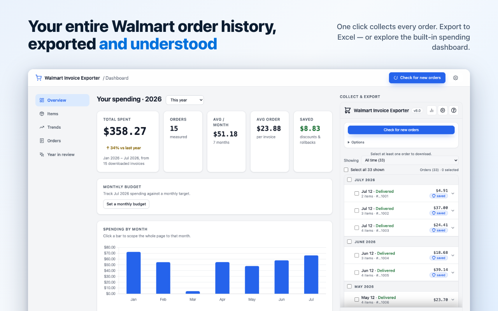

# Walmart Invoice Exporter

A Chrome extension that turns your Walmart order history into a private spending dashboard and clean export files — Excel, CSV, JSON, PDF, or printable receipts. Version 8.0 brings a full-app dashboard with expandable inline invoices and interactive charts, fast request-based collection, Walmart's own order filters as collection options, multi-account support, and a complete visual redesign in light and dark.



More screenshots live in [store-assets/screenshots/](./store-assets/screenshots/): the [inline invoice drill-down](./store-assets/screenshots/02-invoice-drilldown-1280x800.png), [export formats](./store-assets/screenshots/03-export-formats-1280x800.png), [month drill-down in dark mode](./store-assets/screenshots/04-month-drilldown-dark-1280x800.png), and the [privacy view](./store-assets/screenshots/05-privacy-1280x800.png).

**Website:** [github.harsh.al/Walmart-Invoice-Exporter](https://github.harsh.al/Walmart-Invoice-Exporter/) — landing page, Help & FAQ, and privacy policy, deployed from this repo (see [Website](#website-github-pages) below).

## Features

- **Spending Dashboard (full browser page)**: opened with "View dashboard", computed entirely on-device
  - Click any order row to expand its **complete invoice inline** — items, prices, the full money breakdown, and payment methods
  - **Interactive monthly chart** (Chart.js) — click a bar to scope the whole page to that month, then export just that scope
  - Stat cards with vs-previous-period deltas, plus a **"More insights" card**: biggest order, savings rate, average items per order, busiest day, and most-bought item
  - **Price watch** on items you rebuy and a most-bought items list
  - Searchable, sortable orders table grouped by month, with select-the-whole-month checkboxes and scoped export
  - The **live side panel is embedded** beside the dashboard, so collection and export happen without leaving the page
- **One-click collection**: "Load my orders" gathers your history the first time; "Check for new orders" tops it up after that. Page limit, "only new orders", order type, and date range live under the Options disclosure
- **Fast collection (optional)**: request-based collection that reuses your own logged-in session instead of paging through every screen — honors "only new orders", works on filtered views, and fast/classic modes automatically fall back to each other
- **Walmart's own filters as collection options**: order type (Online / In store / In progress / Completed / Returned) and a date range, applied with the site's exact filter grammar
- **Multi-account support**: saved data is scoped per Walmart account, detected privately (only a hash — never your name). The switcher appears only when 2+ accounts have data; accounts can be renamed, deleted individually in Settings, and fetching while the wrong account is signed in is blocked with a clear message
- **Three ways to save**: "Single file" (one file with every selected order), "Multiple files" (one file per order), or "Save details to library (no file)" to store invoices locally without downloading anything
- **Multiple export formats**: Excel (default), accounting-friendly CSV (including QuickBooks and Xero bank-import presets), structured JSON, a printable HTML receipt, or a true PDF receipt
- **Instant re-export**: orders in your local library re-export immediately in any format — nothing is ever fabricated or guessed
- **Batch download**: select and download many order invoices at once
- **Complete visual redesign**: one design language across the panel, settings, and dashboard — light and dark, card-based layout, sticky month headers, sticky download bar
- **Legacy Excel layout (opt-in)**: restores the older single-sheet workbook; the modern Orders/Items two-sheet layout stays the default
- **Inactivity housekeeping (configurable)**: by default, saved data is wiped only if the extension goes unused for 180 days — adjust the number of days or turn it off in Settings
- **Walmart.ca support (optional)**: enable Canada support in Settings to collect and export walmart.ca orders too
- **AI access via MCP (optional, off by default)**: let AI tools on your own computer (Claude Code, Claude Desktop, any MCP client) work with your saved orders through the [walmart-invoice-mcp](https://github.com/hppanpaliya/walmart-invoice-mcp) helper ([on npm](https://www.npmjs.com/package/walmart-invoice-mcp), runs via `npx walmart-invoice-mcp`) — localhost-only, protected by a pairing token you generate in Settings → "AI access (MCP)". Read-only by default (list/search/read orders, spending summaries, exports); a second off-by-default toggle, **"Allow AI tools to collect data"**, additionally lets AI start order collection and invoice fetching using your signed-in session. Deleting data is never possible through AI
- **Dedicated Settings view**: Appearance (System/Light/Dark), Collection defaults (including fast collection), Export defaults, "Data on this device", and About
- **Detailed exports**: each invoice includes:
  - Product details (name, quantity, price)
  - Delivery status
  - Product links
  - Order information (number, date, order type — online vs in-store)
  - Shipping address
  - Payment method and per-card payment split
  - Order subtotal (before fees and taxes)
  - Order total (final amount)
  - Additional charges (delivery, tax, tip) plus refunds and donations
  - Marketplace seller(s), fulfillment type, delivered date, and tracking numbers
  - Receipt barcode link, and optional embedded product thumbnails
- **Secure & efficient**: runs only on Walmart order pages with minimal required permissions — no servers, no telemetry

## Technical Details

- **Manifest V3**: side panel UI, service-worker background, no remotely hosted code
- **Build system**: [WXT](https://wxt.dev)/Vite — live-reload development, per-browser builds, and store zips from one config (`wxt.config.ts`)
- **Permissions**:
  - `activeTab` — order page access for collection and downloads
  - `storage` — local storage of preferences and settings
  - `sidePanel` — the persistent side panel UI (Chrome)
  - Host permissions for `https://www.walmart.com/*`; `https://www.walmart.ca/*` is an **optional** host permission granted only if you enable Canada support
- **Unified on-device storage**:
  - Collected orders and downloaded invoices are saved in IndexedDB, scoped per account
  - A single "Delete all saved data" control (Settings → Data on this device) clears everything at once; per-account delete is also available
  - Optional inactivity retention wipes data only after a configurable number of unused days (default 180) — or never, if turned off
  - No servers, no telemetry — all data stays on your device
- **Order format support**:
  - Regular orders (13 or 15 digits)
  - In-store purchases (20+ digits)
  - Various order statuses (delivered, canceled, returned)
- **Collection engine**:
  - Classic mode pages through the order history in a background tab
  - Fast mode captures your browser's own list request and replays it for the remaining pages — same session, far fewer page loads — with automatic mutual fallback between the two modes
  - Walmart's own filters (order type, date range) are applied to the collection URL using the site's filter grammar
- **Excel generation**: ExcelJS, loaded only when an Excel export actually runs
  - Default two-sheet workbook (Orders + Items) for clean, safely-summable rows; a "Use legacy Excel layout" opt-in restores the older single-sheet format
  - Frozen headers, auto-filters, and proper formatting with hyperlinks
- **Dashboard charts**: Chart.js, bundled locally (no CDN)
- **Performance optimizations**:
  - Aggressive image blocking during collection (CSS, HTML elements, background images)
  - Throttling between downloads to prevent rate limiting
  - Automatic retry with configurable timeout
  - Memory cleanup after each operation

## Limitations

- Works only on Walmart's order pages
- Download speed may vary based on network conditions
- Large batch downloads may take several minutes to complete
- Requires stable and fast internet connection for bulk downloads

## Installation

### From Chrome Web Store

Install the Walmart Invoice Exporter directly from the [Chrome Web Store](https://chromewebstore.google.com/detail/walmart-invoice-exporter/bndkihecbbkoligeekekdgommmdllfpe).

### Building from source

The extension is built with [WXT](https://wxt.dev):

```bash
pnpm install       # installs dependencies (postinstall runs `wxt prepare`)
pnpm run dev        # live-reload development build — WXT opens a browser with the extension loaded
pnpm run build      # production build into dist/chrome-mv3
```

To load the production build manually:

1. Run `pnpm run build`
2. Open Chrome and go to `chrome://extensions/`
3. Enable "Developer mode" in the top-right corner
4. Click "Load unpacked" and select the `dist/chrome-mv3` folder
5. Pin the extension to your toolbar for easy access

### Tests

```bash
pnpm test             # unit tests (node:test)
pnpm run test:vitest   # Vitest suite
pnpm run test:e2e      # Playwright end-to-end suite driving the packaged extension
pnpm run test:all      # unit + e2e
```

### Store packages

```bash
pnpm run zip           # Chrome/Edge store zip
pnpm run zip:firefox   # Firefox (MV3) zip, including the AMO sources zip
```

### Website (GitHub Pages)

The project website (landing page, Help & FAQ, privacy policy) is live at [github.harsh.al/Walmart-Invoice-Exporter](https://github.harsh.al/Walmart-Invoice-Exporter/). It lives in [site/](./site/) and deploys to GitHub Pages automatically via [.github/workflows/pages.yml](./.github/workflows/pages.yml) on every push to `main` that touches it. Images aren't duplicated: [scripts/build-site.sh](./scripts/build-site.sh) assembles `_site/` at build time, pulling screenshots from `store-assets/screenshots/` and the icon from `public/images/`, so the store listing and the website can never drift apart.

```bash
bash scripts/build-site.sh    # assemble into _site/
npx serve _site               # preview locally
```

The repo's Pages source is set to **"GitHub Actions"** (Settings → Pages → Build and deployment → Source — required once when forking). This replaces the old branch-based Pages source; the FAQ formerly served from `docs/` now lives at [/faq.html](https://github.harsh.al/Walmart-Invoice-Exporter/faq.html).

### Microsoft Edge

Edge (Chromium) runs the Chrome package unmodified: build with `pnpm run build` and load `dist/chrome-mv3` from `edge://extensions` ("Developer mode" → "Load unpacked"), or use the zip from `pnpm run zip`. See [docs/PORTS.md](./docs/PORTS.md) for store-submission notes.

### Firefox

Build the Firefox package with:

```bash
pnpm run build:firefox   # unpacked build
pnpm run zip:firefox     # store zip + AMO sources zip
```

To load it temporarily (removed on browser restart): open `about:debugging#/runtime/this-firefox`, click "Load Temporary Add-on…", and select the `manifest.json` inside the Firefox build output. Permanent installs require the zip to be signed by [addons.mozilla.org](https://addons.mozilla.org/developers/).

Notes:

- Firefox uses a browser **sidebar** (`sidebar_action`) instead of Chrome's side panel — the UI opens in Firefox's global sidebar, which looks and docks differently.
- The Firefox build is produced and validated but **untested live** against walmart.com.

See [docs/PORTS.md](./docs/PORTS.md) for the full list of differences.

## What's New

### Version 8.2 (July 19, 2026)
- **MCP does much more**: new read tools (`search_orders`, `spending_summary`, `export_orders`) and — behind a new off-by-default Settings toggle, **"Allow AI tools to collect data"** — action tools that let AI start order collection (`start_collection`, with filters and progress polling) and fetch invoices in a background tab (`collect_invoices`). Requires [walmart-invoice-mcp](https://www.npmjs.com/package/walmart-invoice-mcp) v0.2+

### Version 8.1 (July 19, 2026)
- **Optional AI access (MCP)**: a new off-by-default Settings toggle lets local AI tools (Claude Code, Claude Desktop, any MCP client) read your saved orders through the [walmart-invoice-mcp](https://github.com/hppanpaliya/walmart-invoice-mcp) helper ([on npm](https://www.npmjs.com/package/walmart-invoice-mcp)) — read-only, localhost-only, token-paired
- **Project website launched**: [github.harsh.al/Walmart-Invoice-Exporter](https://github.harsh.al/Walmart-Invoice-Exporter/) — landing page, Help & FAQ, and privacy policy
- **Tooling moved to pnpm** with a 14-day supply-chain cooldown (`minimumReleaseAge`) on dependency updates

### Version 8.0 (July 19, 2026)
- **Full-app dashboard**: click any order row to expand its complete invoice inline (items, prices, money breakdown, payment details); real interactive charts with click-to-scope months; a "More insights" card (biggest order, savings rate, average items per order, busiest day, most-bought item); month group rows with select-the-whole-month checkboxes
- **Fast collection is first-class**: request-based, honors "only new orders", works on filtered views, with automatic mutual fallback between fast and classic modes
- **Walmart's own order filters as collection options**: order type (Online / In store / In progress / Completed / Returned) and a date range
- **Multi-account support**: per-account data scoping (privacy-preserving hash only), renamable accounts, per-account delete, and a wrong-account fetch guard — shown only when 2+ accounts have data
- **Complete visual redesign** of the panel, settings, and dashboard in light and dark
- **New build system (WXT/Vite)**: `pnpm run dev` for live development, `pnpm run zip` / `zip:firefox` for store packages

### Version 7.3 (July 18, 2026)
- **Full-page Spending Dashboard** with the live panel embedded beside it — scope by period, click a month to drill in, watch prices on items you rebuy, and export exactly what's on screen
- **Receipt-style order list** grouped by month, with a "Showing" range filter
- Product links now survive Walmart's data-shape changes (built from the item id when the payload omits the URL)

### Version 7.0 (July 17, 2026)
- **Redesigned download** — two buttons, **Single file** (one file with every selected order) and **Multiple files** (one file per order), replace the old Download + Quick Export. Already-downloaded orders re-export instantly.
- **Legacy Excel layout** option restores the older single-sheet workbook
- **Dark mode** plus a dedicated **Settings** view
- **Unified on-device storage** with one "Delete all saved data" control — fixes the old "cache won't clear" issue

### [Changelog](./CHANGELOG.md)

## Usage

### Single Order Download

1. Navigate to a specific Walmart order page
2. Click the extension icon — the order appears automatically
3. Check its box, then click "Single file"

### Batch Download

The panel offers three ways to save:

#### Single file
Downloads every selected order into one workbook/file.

#### Multiple files
Downloads one file per selected order.

#### Save details to library (no file)
Stores the full invoices locally without downloading anything — export any time later, instantly, in any format.

The two download buttons use whatever format is currently selected, and the button label always shows it — e.g. "Single file (.xlsx)".

**To Use Batch Download:**

1. Go to your Walmart order history page (https://www.walmart.com/orders)
2. Click the extension icon
3. Click "Load my orders" (first time) or "Check for new orders" (after that) — the Options disclosure holds the page limit, "only collect new orders", order type, and date range
4. Wait for the order numbers to load (may take a few seconds depending on page count)
5. Look for the **"saved" badge** next to orders already in your library — those re-export instantly, no page revisit needed
6. Select the orders you want (or tick a whole month at once)
7. (Optional) Pick a format from the "Export format" dropdown (Excel/CSV/JSON/printable receipt/PDF); toggle "Use legacy Excel layout" if you prefer the older single-sheet workbook
8. Click "Single file", "Multiple files", or "Save details to library (no file)"
9. Wait for the downloads to complete

### Spending Dashboard

1. Click "View dashboard" in the panel to open the full-page dashboard (the live panel is embedded beside it)
2. Click a bar in the monthly chart to scope the whole page to that month — click again to zoom back out
3. Click any order row to expand its full invoice inline; if a row says the full invoice hasn't been fetched yet, select it and click "Fetch data"
4. Use search, sorting, and the month group checkboxes to find and select orders, then export exactly what's in scope

**Your Data:**

- Saved orders live on this device (IndexedDB), scoped per account — nothing is sent anywhere
- By default, data is wiped only if the extension goes unused for 180 days (configurable, or turn it off in Settings)
- Open Settings (gear icon) → "Data on this device" → "Delete all saved data" to wipe everything the extension has stored, in one step — or delete a single account's data

## Troubleshooting

### Required Chrome Settings for Downloads

Before using the download feature, make sure to configure Chrome settings:

#### 1. Configure Download Settings:

- Open Chrome Settings or paste the following link in the address bar:

```
chrome://settings/downloads
```

- Click on "Downloads" in the left sidebar if not already selected
- Turn OFF "Ask where to save each file before downloading"
- Turn OFF "Show downloads when they're done"

#### 2. Enable Automatic Downloads:

```
chrome://settings/content/siteDetails?site=https%3A%2F%2Fwww.walmart.com#:~:text=Automatic%20downloads
```

- Open a new Chrome tab and paste the above link
- Find "Automatic downloads" option
- Set it to "Allow" (instead of Ask or Block)

#### Alternative Method: (If the above link doesn't work):

```
chrome://settings/content/automaticDownloads
```

- Open a new Chrome tab and paste the above link
- Under "**Allowed to automatically download multiple files**", click Add
- Enter `[*.]walmart.com` and click Add

> **Important**: All these settings are required for bulk downloads to work properly. Make sure to add walmart.com under "**Allowed to automatically download multiple files**" and NOT under "Not allowed to automatically download multiple files"

### Common Issues

**Issue: Side panel appears but no orders are shown**
- Solution: Refresh the Walmart orders page and try again
- Previously collected orders load automatically if available; otherwise, click "Load my orders"

**Issue: A collection with filters returns nothing**
- Solution: The panel explains when a filter combination genuinely matches no orders — try widening the order type or date range under Options

**Issue: The dashboard shows an order without full details**
- Solution: Select the order and click "Fetch data" to pull its complete invoice into the library

**Issue: Fetching fails because the wrong Walmart account is signed in**
- Solution: This is intentional — the extension blocks fetching another account's orders. Sign in to the matching account, or switch the panel to the signed-in account

**Issue: Download takes too long**
- Solution: Enable "Fast collection" in Settings → Collection for far fewer page loads
- Try downloading fewer orders at a time (5-10 orders initially)
- Check your internet connection speed

**Issue: Some orders fail to download in batch mode**
- Solution: The extension will automatically retry failed orders
- Try downloading those specific orders individually
- Check the console (F12 > Console tab) for error details

**Issue: A saved order won't re-export with fresh data**
- Solution: Open Settings → "Data on this device" → "Delete all saved data", then re-download the order to store it fresh

**Issue: "Single file" combines orders but items are not organized**
- Solution: "Single file" intentionally combines all selected orders into one workbook/file
- If you need one file per order, use "Multiple files" instead

**Getting Help:**

1. Read the FAQ in the extension side panel ("Help & FAQ" button) for detailed guides
2. Check that the extension has necessary permissions
3. Verify Chrome download settings as described above
4. For batch downloads, start with smaller batches to identify issues
5. If you're still facing issues, please submit a detailed bug report with:
   - Screenshot of the error
   - Number of orders attempted
   - Your Chrome version
   - The browser console output (F12 > Console)

## Performance Tips

For best results when using the extension:

### During Order Collection:
1. Turn on "Fast collection" in Settings → Collection — it replays your browser's own request instead of loading every page
2. Turn on "only collect new orders" under Options for quick re-syncs — collection stops at the first page it already knows
3. Use the order type and date range options to collect only what you need
4. On slower connections, classic collection may take time — be patient

### During Batch Downloads:
1. Close unnecessary browser tabs and applications
2. Start with smaller batches (5-10 orders)
3. Ensure stable and fast internet connection
4. For "Single file" mode with large selections, processing time increases with order count
5. Allow the extension to complete its process without interruptions
6. Keep the side panel open during downloads

### Your Data:
1. Orders in your library are marked with a "saved" badge and re-export instantly, in any format
2. Use Settings → "Data on this device" → "Delete all saved data" whenever you want a clean slate — it clears everything, in one step
3. Data stays until you delete it — unless you leave the extension unused past the inactivity window (180 days by default; adjustable or off)

### Format & Button Selection:
1. Use **"Multiple files"** for easier organization and quick per-order downloads
2. Use **"Single file"** when you need everything consolidated for analysis
3. Use **"Save details to library (no file)"** to build up your dashboard and export later
4. Format and layout preferences (Excel/CSV/JSON/receipt/PDF, CSV preset, legacy layout) are saved between sessions

## Contributing

Contributions welcome! Please:

1. Fork the repository
2. Create a feature branch
3. Commit your changes
4. Push to the branch
5. Submit a Pull Request

## Architecture

The extension is built with WXT/Vite and a modular design for maintainability:

**Core Files (in `public/`):**
- `sidepanel.html` / `sidepanel.css` - Side panel UI structure and styles
- `sidepanel.js` - Side panel entry point and orchestration
- `sidepanel.state.js` - Shared UI state management
- `sidepanel.view.js` - DOM rendering and view helpers
- `sidepanel.actions.js` - User action handlers (collection, accounts, etc.)
- `sidepanel.download.js` - Download orchestration and progress tracking
- `sidepanel.settings.js` - The Settings view (appearance, collection, export, data, about)
- `dashboard.page.js` / `dashboard.css` - The full-page Spending Dashboard
- `background-main.js` - Background service worker for collection and storage
- `content.js` + `providers/` - Content script and per-site providers (walmart.com, walmart.ca) for order extraction
- `walmart-mainworld.js` - MAIN-world capture script for the page's own data/requests
- `orderdb.js` - IndexedDB storage layer (per-account scoping, retention)
- `utils.js` - Shared constants, Excel generation, and UI utilities
- `wxt.config.ts` (repo root) - Manifest and build configuration

**Key Components:**
1. **On-Device Storage (IndexedDB via `orderdb.js`)** - Stores orders per account, with per-account delete, one "Delete all saved data" control, and optional inactivity retention
2. **Collection Engine** - Classic page crawling plus fast request-replay collection, with Walmart's own filters (order type, date range) and automatic mutual fallback
3. **Export Engines** - "Single file", "Multiple files", and library-only saves, across all export formats
4. **UI Controller** - Modular side panel (state / view / actions / download / settings)
5. **Spending Dashboard** - A full browser page with time- and month-scoped stats, a clickable Chart.js monthly chart, inline invoice drill-down, price watch, insights, a searchable orders table, and the live side panel embedded for collection and export
6. **Performance Optimizer** - Image blocking, throttling, and on-demand ExcelJS loading

**Data Flow:**
1. User starts collection from the side panel ("Load my orders" / "Check for new orders")
2. The background worker collects the order list — fast mode replays the page's own request; classic mode pages through a background tab
3. Orders render in the side panel, grouped by month; previously-saved orders load from IndexedDB instantly
4. User selects orders and clicks "Single file", "Multiple files", or "Save details to library (no file)"
5. Full order data is saved on-device (scoped to the signed-in account) for instant re-export and dashboard analytics
6. The dashboard computes every chart, stat, and insight from that local data — nothing leaves the device

## Version History

For a complete list of changes, see [CHANGELOG.md](./CHANGELOG.md)

**Latest (v8.0):** Full-app Spending Dashboard (inline invoice drill-down, interactive click-to-scope charts, insights card, month-group selection), fast request-based collection with automatic classic fallback, Walmart's own order filters as collection options, multi-account support, a complete light/dark redesign, and the new WXT build system.

## Support

For issues or feature requests, please:

1. Check existing issues in the repository
2. Submit a new issue if needed
3. Include specific details about the problem

## Privacy & Data Security

This extension prioritizes your privacy and security:

**Data Storage:**
- Order data is stored in IndexedDB, on your device only, scoped per Walmart account
- Multi-account detection stores only a privacy-preserving hash — never your name or email
- Preferences and settings are stored in Chrome's local storage
- No data is sent to external servers — no servers, no telemetry

**Only Runs On:**
- Walmart's order pages (`https://www.walmart.com/orders*`, and `https://www.walmart.ca/orders*` only if you enable the optional Canada support)
- Cannot access other websites or your browsing history

**Permissions Explanation:**
- `activeTab` - Allows the extension to access the current Walmart order page
- `storage` - Allows local storage of your saved orders and preferences on your device
- `sidePanel` - Powers the persistent side panel UI
- `host_permissions` for `walmart.com` - Required to access Walmart order data; `walmart.ca` is optional and granted only if you turn it on

**Data Processing:**
- All parsing, Excel/PDF generation, and dashboard analytics happen locally in your browser
- Fast collection reuses your own logged-in session — requests go only to walmart.com, exactly as your browser would send them
- Images are blocked during collection for performance (not accessed or stored)
- No tracking or analytics implemented
- No cookies or external API calls
- Optional AI access (MCP) is off by default; when enabled, the extension only connects to `127.0.0.1` on your own machine (token-paired, read-only by default) — nothing goes to the internet. The separate "Allow AI tools to collect data" toggle (also off by default) gates collection/invoice-fetch actions; deletion is never possible through AI

**Your Control:**
- Settings → "Data on this device" → "Delete all saved data" wipes everything the extension has stored, in one step — per-account delete is also available
- Optional inactivity retention (on by default) deletes saved data only after 180 days without using the extension; adjust the days or turn it off
- Your data is always under your control in your browser's storage

## Acknowledgments

Special thanks to all the users who provided feedback for making this extension more efficient and user-friendly. This project is continually improved based on community feedback and real-world usage patterns.

**Dependencies:**
- [WXT](https://wxt.dev) - Build system (Vite-based) for development, builds, and store zips
- [ExcelJS](https://github.com/exceljs/exceljs) - For robust XLSX file generation
- [Chart.js](https://www.chartjs.org/) - For the dashboard's interactive charts (bundled locally)

## License

MIT License - feel free to use and modify as needed.
